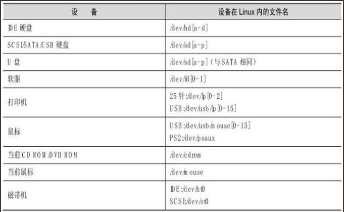
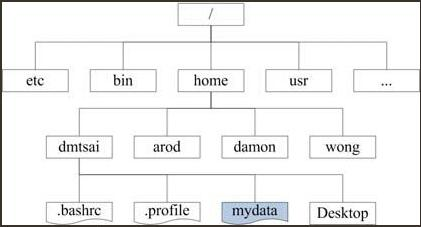
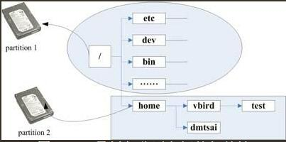

## 主机规划与磁盘分区

### 1 、主机规划

#### 1.1 Linux 硬件

​	CPU, RAM, Hard Disk, Network Interface Card, 

#### 1.2 硬件设备在Linux中文件名

​	在Linux系统中，每个设备都被当成一个文件来对待。举例来说，IDE接口的硬盘的文件名即为/dev/hd[a-d]，其中，括号内的字母为a-d当中的任意一个，也即有/dev/hda,/dev/hdb,/dev/hdc,及/dev/hdd这四个文件的意思。

常见设备名如下

### 2、磁盘分区

以SATA接口来说，由于SATA/USB/SCSI等磁盘接口都是使用SCSI模块来驱动的，因此这些接口的磁盘设备文件名都是/dev/sd[a-p]的格式。但是与IDE接口不同的是，SATA/USB接口根据Linux内核检测到磁盘的顺序，依此为a,b,c...

磁盘第一个扇区主要记录了两个重要信息

- 主引导分区 （Master Boot Record, MBR）：可以安装引导加载程序的地方，有446bytes。
- 分区表（partition table）： 记录整块硬盘分区的状态，有64bytes。

开机到操作系统之前的动作

BIOS >> 访问引导分区MBR (GPT) >>加载程序Boot Loader(多系统) >>内核文件

BIOS 与 MBR 都是硬件本身会支持的功能，至于 Boot loader 则是操作系统安装在MBR上面的一套软件了。由于MBR仅有446bytes而已，因此这个引导加载程序是非常小而完美的。这个 boot loader 的主要任务有下面这些项目。

提供菜单：用户可以选择不同的开机选项，这也是多重引导的重要功能。

载入内核文件：直接指向可开机的程序区段来开始操作系统。

转交其他loader：将引导加载功能转交给其他loader负责。

### 3、目录树结构(directory tree)

- 根目录(root directory) `/`

  长方形为目录，波浪形则为文件

  

- 挂载

  所谓的“挂载”就是利用一个目录当成进入点，将磁盘分区的数据放置在该目录下； 也就是说，进入该目录就可以读取该分区的意思。这个操作我们称为“挂载”，那个进入点的目录我们称为“挂载点”。

  举例

  

上图中，硬盘分为两区，partition 1 挂载到根目录，至于 partition 2 则是挂载到/home这个目录。这也就是说，当我的数据放置在/home 内的各次目录时，数据是放置到 partition 2 的，如果不是放在/home 下面的目录，那么数据就会被放置到 partition 1。

其实判断某个文件在哪个partition下面是很简单的，通过反向追踪即可。要知道`/home/vbird/test `这个文件在哪个 partition 时，由`test --> vbird --> home -->/`，看哪个“进入点”先被查到那就是使用的进入点了。所以test使用的是`/home`这个进入点而不是`/`

​	